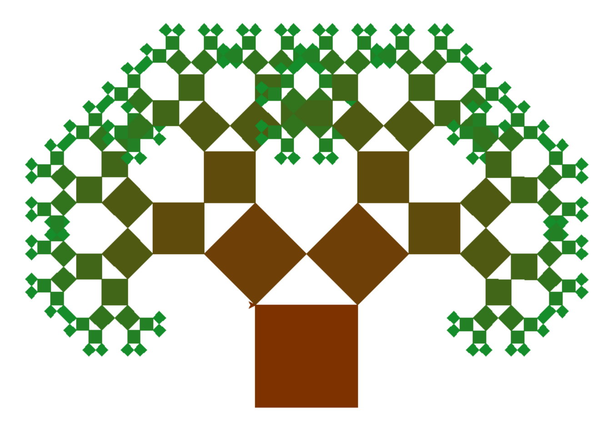

# Square Tree Fractal
Generate a fractal square tree with turtle

## How to use

Make sure you have Python 3 installed
<br><br>
Launch **square_tree.py** then in the command line enter a number :

```
Choose the number of iteration :
```

The process is slow but you can see the image being drawn in real time

## Example

### Number of itareation : 4


### Number of itareation : 7

